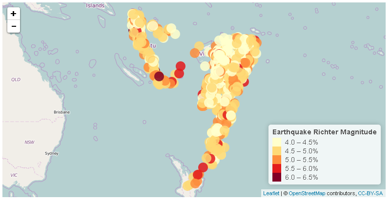

## Introduction

* This presentation is part of the course assignment fo module Developing Data Products from Data Science Spacialization from Johns Hopkins University

* The app has been developed with shiny

* The goal of the app is to help to explore earthquakes in Fiji Area

* Dataset used can be found in datasets library. This dataset ive the locations of 1000 seismic events of MB > 4.0. The events occurred in a cube near Fiji since 1964 and contains the following fields:
    + lat: Latitude of event
    + long: Longitude
    + depth: Depth (km)
    + mag: Richter Magnitude
    + stations: Number of stations reporting

--- 

## Map view

In the app it is shown where the earthquakes took place in a map and the magnitude:



--- 

## Correlation figures

Here is intended to be shown the correlation plots used in the tool with ggplot2 library.

```{r corr, results = 'asis', comment = NA, message = F, echo = F, cache = FALSE}
library(ggplot2)
library(gridExtra)

plot1 <- ggplot(quakes) +
      geom_jitter(aes(quakes$mag, quakes$depth), height = 0.4, width = 0.4, alpha = 0.5, color = "blue") +
      xlab("Magnitude (Richter)") +
      ylab('Earthquake depth (km)') +
      ggtitle('Earthquake magnitude Vs depth')
plot2 <- ggplot(quakes) +
      geom_jitter(aes(quakes$mag, quakes$stations), height = 0.4, width = 0.4, alpha = 0.5, color = "blue") +
      xlab("Magnitude (Richter)") +
      ylab('Number of stations (#)') +
      ggtitle('Earthquake magnitude Vs number of stations')
grid.arrange(plot1, plot2, ncol=2)
```


--- 

## Local run and requirements

* The app is running in shinyapps.io until free quota is reached: https://eregmig.shinyapps.io/Course_assignment/
* Source Files can be found in Github: https://github.com/eregmig/Developing-Data-Products
* Requirements:
    + leaflet
    + ggplot2
    + gridextra
    + shiny

